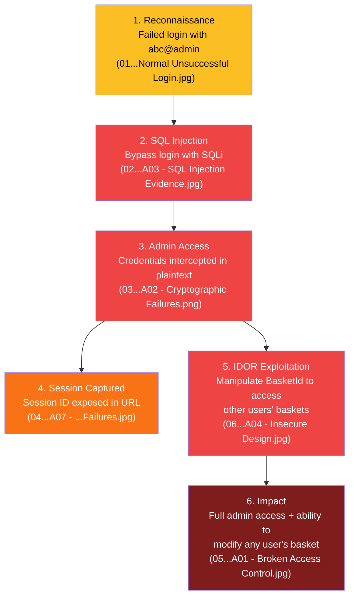

# OWASP Juice Shop - Vulnerability Analysis Report

> **Target:** OWASP Juice Shop @ `192.168.56.101:3000`
> **Tools Used:** Burp Suite Community Edition v2026.3.2 (Proxy Intercept), Kali Linux Browser
> **Date Captured:** June 11, 2026

---

## Summary of Evidence (All 6 Screenshots)

| # | Filename | Source | Key Observation |
|---|----------|--------|-----------------|
| 1 | `01 OWASP Juice-Shop Normal Unsuccessful Login.jpg` | Browser | Failed login with `abc@admin` - error: "Invalid email or password" |
| 2 | `02 OWASP Juice-Shop A03 - SQL Injection Evidence.jpg` | Browser (Kali) | `[object Object]` in red text + green banner: "You successfully solved a challenge: Error Handling" - confirms SQL injection bypass |
| 3 | `03 OWASP Juice-Shop A02 - Cryptographic Failures.png` | Burp Proxy | POST to `/rest/user/login` with plaintext credentials `admin@admin.com` / `admin@1` over HTTP |
| 4 | `04 OWASP Juice Shop A07 - Identification and Authentication Failures.jpg` | Burp Proxy | WebSocket/polling requests exposing **session ID (`sid`)** in URL query parameters |
| 5 | `05 OWASP Juice-Shop A01 - Broken Access Control.jpg` | Browser | Basket page for `admin@admin.com` showing Apple Juice item - result of IDOR exploitation |
| 6 | `06 OWASP Juice-Shop A04 - Insecure Design.jpg` | Burp Proxy | POST to `/api/BasketItems/` with user-controllable `BasketId: "6"` in request body |

---

## Vulnerability Breakdown

### 1. SQL Injection (SQLi)

> [!CAUTION]
> **OWASP Top-10: A03:2021 - Injection**

**Evidence:** `02 OWASP Juice-Shop A03 - SQL Injection Evidence.jpg`

The login page displays **`[object Object]`** in red/orange text above the email field. Additionally, a **green success banner** at the top reads:

> *"You successfully solved a challenge: Error Handling (Provoke an error that is neither very gracefully nor consistently handled.)"*

This confirms two things: (1) SQL injection was successfully used to bypass authentication, and (2) the application's error handling challenge was triggered because the injected query caused an improperly handled error.

**What happened:**
- The login endpoint (`/rest/user/login`) does not sanitize the `email` field
- An attacker can inject SQL like `' OR 1=1--` into the email field
- The query returns **all user rows** instead of one, and the application tries to display the first result
- Because the result is a raw database object (not a string), the UI renders it as **`[object Object]`** - exactly what is shown in red on the login page
- The attacker gains access as the **first user in the database** - typically the admin
- The green banner confirms the Juice Shop recognized this as a successful exploit of its "Error Handling" challenge

**Severity:** Critical

**OWASP Classification:**
- **A03:2021 - Injection** (primary)
- **A07:2021 - Identification and Authentication Failures** (secondary - auth bypassed)

---

### 2. Sensitive Data Exposure - Credentials in Plaintext over HTTP

> [!CAUTION]
> **OWASP Top-10: A02:2021 - Cryptographic Failures**

**Evidence:** `03 OWASP Juice-Shop A02 - Cryptographic Failures.png`

The Burp Suite Proxy intercept shows a POST request to `http://192.168.56.101:3000/rest/user/login` with the following plaintext body:

```json
{
    "email": "admin@admin.com",
    "password": "admin@1"
}
```

The browser address bar across multiple screenshots shows **"Not secure"** - confirming the entire application runs over unencrypted HTTP.

**What happened:**
- The entire application runs over **unencrypted HTTP** (no TLS/HTTPS)
- Login credentials (`admin@admin.com` / `admin@1`) are transmitted in **plaintext**
- Any attacker on the same network can perform a **Man-in-the-Middle (MITM)** attack to sniff credentials
- Burp Suite intercepted and displayed the full credential payload without any decryption needed
- The HTTP history also reveals follow-up requests to `/rest/user/whoami?fields=email` and `/rest/user/whoami` - leaking user identity endpoints

**Severity:** Critical

**OWASP Classification:**
- **A02:2021 - Cryptographic Failures** (primary - no TLS)
- **A07:2021 - Identification and Authentication Failures** (secondary)

---

### 3. Broken Authentication - Weak/Default Credentials + Session ID Exposure

> [!WARNING]
> **OWASP Top-10: A07:2021 - Identification and Authentication Failures**

**Evidence:**
- `03 OWASP Juice-Shop A02 - Cryptographic Failures.png` (weak password visible)
- `04 OWASP Juice Shop A07 - Identification and Authentication Failures.jpg` (session ID in URL)

**Weak Credentials:**
The intercepted login request (Screenshot 03) shows the admin account uses password `admin@1` - an extremely weak, guessable password following the pattern `[username]@[digit]`.

**Session ID Exposure:**
The Burp Suite intercept (Screenshot 04) shows WebSocket/polling requests with the session identifier embedded directly in the URL:

```
POST /socket.io/?EIO=4&transport=polling&t=Pwsps43&sid=6arOotgtnKAPhA73AAAP HTTP/1.1
```

**What happened:**
- The admin account uses a trivially guessable password (`admin@1`)
- No evidence of rate limiting, CAPTCHA, or account lockout on the login endpoint
- The `sid` (session ID) parameter `6arOotgtnKAPhA73AAAP` is embedded in URL query parameters
- URLs are logged in browser history, server logs, proxy logs, and potentially Referer headers
- If the session ID is shared or leaked, an attacker could **hijack the session**
- Session IDs should be transmitted only via HTTP-only, Secure cookies - never in URLs

**Severity:** High

**OWASP Classification:**
- **A07:2021 - Identification and Authentication Failures**

---

### 4. IDOR - Insecure Direct Object Reference

> [!CAUTION]
> **OWASP Top-10: A01:2021 - Broken Access Control**

**Evidence:**
- `06 OWASP Juice-Shop A04 - Insecure Design.jpg` (Burp intercept showing manipulable BasketId)
- `05 OWASP Juice-Shop A01 - Broken Access Control.jpg` (resulting basket page)

The Burp Suite Proxy intercept (Screenshot 06) shows a POST request to `http://192.168.56.101:3000/api/BasketItems/` with the following body:

```json
{
    "ProductId": 1,
    "BasketId": "6",
    "quantity": 1
}
```

Screenshot 05 then shows the resulting basket page for `admin@admin.com` with Apple Juice (1000ml) successfully added.

**What happened:**
- The `BasketId` is sent as a **client-controlled parameter** in the POST body
- The server does **not validate** whether `BasketId: "6"` actually belongs to the currently authenticated user
- An attacker can change `"6"` to any other basket ID (e.g., `"1"`, `"2"`, `"3"`) to **add items to another user's basket**
- This is a textbook **IDOR vulnerability** - the server trusts the client-supplied object reference
- Screenshot 05 confirms the item was successfully added to the target basket

**Severity:** High

**OWASP Classification:**
- **A01:2021 - Broken Access Control** (primary)
- **A04:2021 - Insecure Design** (secondary - the API was designed to accept BasketId from the client instead of deriving it server-side)

---

### 5. Insecure Design - Client-Trusted BasketId

> [!WARNING]
> **OWASP Top-10: A04:2021 - Insecure Design**

**Evidence:** `06 OWASP Juice-Shop A04 - Insecure Design.jpg`

This vulnerability is the **root cause** behind the IDOR in Section 4. The API endpoint `/api/BasketItems/` was **designed** to accept the `BasketId` from the client request body rather than deriving it from the server-side session.

**What happened:**
- The application architecture trusts the client to provide the correct `BasketId`
- There is no server-side authorization check to verify basket ownership
- This is a design-level flaw, not just a missing validation check - the API contract itself is insecure
- A secure design would derive the basket ID from the authenticated user's session, never from client input

**Severity:** High

**OWASP Classification:**
- **A04:2021 - Insecure Design**

---

### 6. Verbose Error Messages / Information Disclosure

> [!NOTE]
> **OWASP Top-10: A05:2021 - Security Misconfiguration**

**Evidence:**
- `01 OWASP Juice-Shop Normal Unsuccessful Login.jpg` (failed login error)
- `02 OWASP Juice-Shop A03 - SQL Injection Evidence.jpg` (raw object + challenge banner)

**What happened:**
- **Screenshot 01:** The error message "Invalid email or password" is actually a *reasonable* practice (doesn't reveal which field is wrong)
- **Screenshot 02:** The application renders a raw internal object (`[object Object]`) in red text on the UI when SQL injection succeeds - this **leaks internal implementation details** and confirms that injection worked
- **Screenshot 02:** The green challenge banner ("You successfully solved a challenge: Error Handling") reveals that the application has a gamified challenge system, disclosing internal application behavior to the attacker
- The `/rest/user/whoami?fields=email` endpoint (visible in Screenshot 03's HTTP history) may expose user data through **field selection parameters** that could be manipulated

**Severity:** Medium

**OWASP Classification:**
- **A05:2021 - Security Misconfiguration**

---

## OWASP Top-10 (2021) Mapping Summary

| OWASP Category | Vulnerability Found | Evidence Screenshot |
|---|---|---|
| **A01 - Broken Access Control** | IDOR on BasketId | `05...A01 - Broken Access Control.jpg`, `06...A04 - Insecure Design.jpg` |
| **A02 - Cryptographic Failures** | No TLS/HTTPS, plaintext creds | `03...A02 - Cryptographic Failures.png` |
| **A03 - Injection** | SQL Injection on login | `02...A03 - SQL Injection Evidence.jpg` |
| **A04 - Insecure Design** | Client-trusted BasketId | `06...A04 - Insecure Design.jpg` |
| **A05 - Security Misconfiguration** | Verbose errors, raw object rendered | `02...A03 - SQL Injection Evidence.jpg` |
| **A06 - Vulnerable Components** | Not directly observed | - |
| **A07 - Auth Failures** | Weak creds, session ID in URL | `03...A02 - Cryptographic Failures.png`, `04...A07 - ...Failures.jpg` |
| **A08 - Software/Data Integrity** | Not directly observed | - |
| **A09 - Logging & Monitoring** | Not directly observed | No evidence of attack detection |
| **A10 - SSRF** | Not directly observed | - |

> [!IMPORTANT]
> **5 out of 10 OWASP Top-10 categories are directly confirmed** from these 6 screenshots: **A01 (IDOR)**, **A02 (No HTTPS)**, **A03 (SQLi)**, **A04 (Insecure Design)**, and **A07 (Weak Auth + Session Exposure)**. A05 (Security Misconfiguration) is also partially confirmed via verbose error output.

---

## Specific Vulnerability Type Checklist

| Vulnerability Type | Found? | Evidence Screenshot |
|---|---|---|
| **SQL Injection (SQLi)** | YES | `02...A03 - SQL Injection Evidence.jpg` - `[object Object]` + challenge banner |
| **IDOR** | YES | `06...A04 - Insecure Design.jpg` - `BasketId` is attacker-controllable |
| **XSS (Cross-Site Scripting)** | Not directly observed | No reflected/stored XSS payload visible in these screenshots |
| **Broken Authentication** | YES | `03...A02 - Cryptographic Failures.png` - weak password `admin@1` |
| **Sensitive Data Exposure** | YES | `03...A02 - Cryptographic Failures.png` - credentials over HTTP |
| **CSRF** | Not directly observed | No anti-CSRF tokens visible in requests, but not explicitly tested |
| **Session Hijacking** | YES | `04...A07 - ...Failures.jpg` - session ID (`sid`) in URL |
| **Privilege Escalation** | YES | `02...A03 - SQL Injection Evidence.jpg` - SQLi grants admin access |
| **Brute Force** | Likely possible | No CAPTCHA or lockout observed on login endpoint |

---

## Attack Chain (How These Connect)

The 6 screenshots, when put together, tell a **complete attack story**:



---

## Screenshot-to-Vulnerability Quick Reference

| Filename | OWASP Category | Vulnerability |
|----------|---------------|---------------|
| `01 OWASP Juice-Shop Normal Unsuccessful Login.jpg` | A05 (partial) | Baseline - normal login failure, error message behavior |
| `02 OWASP Juice-Shop A03 - SQL Injection Evidence.jpg` | A03, A05 | SQL Injection bypass + Error Handling challenge solved |
| `03 OWASP Juice-Shop A02 - Cryptographic Failures.png` | A02, A07 | Plaintext credentials over HTTP, weak admin password |
| `04 OWASP Juice Shop A07 - Identification and Authentication Failures.jpg` | A07 | Session ID (`sid`) exposed in URL parameters |
| `05 OWASP Juice-Shop A01 - Broken Access Control.jpg` | A01 | Basket page showing result of IDOR exploitation |
| `06 OWASP Juice-Shop A04 - Insecure Design.jpg` | A04, A01 | Client-controllable `BasketId` in POST body |

---

## Recommendations

| # | Fix | Priority | Related Screenshot |
|---|-----|----------|-------------------|
| 1 | **Use parameterized queries / prepared statements** to prevent SQL injection | Critical | `02...A03` |
| 2 | **Enforce HTTPS (TLS)** across the entire application | Critical | `03...A02` |
| 3 | **Server-side validation of BasketId** - derive it from the authenticated session, never from client input | Critical | `06...A04`, `05...A01` |
| 4 | **Enforce strong password policies** - minimum length, complexity, deny common passwords | High | `03...A02` |
| 5 | **Move session IDs to HTTP-only, Secure cookies** - never expose in URLs | High | `04...A07` |
| 6 | **Implement rate limiting and account lockout** on login endpoints | High | `01...Normal Unsuccessful Login` |
| 7 | **Sanitize error output** - never render raw internal objects to the UI | Medium | `02...A03` |
