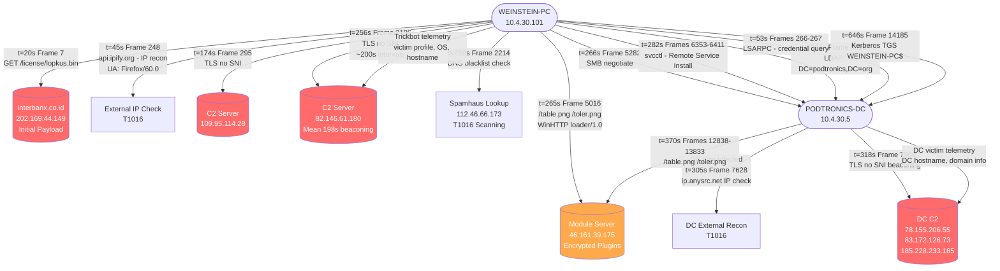

# A.3 — Hypothesis-Driven Deep Dive
## Trickbot: Client to Domain Controller
**Project KAVACH · Workstream A · Network Forensics**
**PCAP:** `2018-04-30-Trickbot-goes-from-client-to-domain-controller.pcap`
**Analyst:** [handle] · **Date:** 2026-05-29

---

## Why This PCAP Is a Defensible Analogue for Meridian FinServe

Meridian FinServe Pvt. Ltd. is a mid-sized NBFC in Mumbai with 720 employees, 180,000 borrowers, and 22,000 merchants. It runs a customer-facing portal for loan applications and EMI servicing, a partner portal for merchant onboarding, and internal traffic flowing between branch offices, two data centres, and a small public cloud. **This makes it a high-value target for banking trojans like Trickbot**, which specifically target financial institutions to steal credentials, banking data, and customer account information.

**This PCAP is a direct analogue because:**

| Meridian FinServe Risk | Trickbot PCAP Evidence |
|---|---|
| Finance company = prime Trickbot target | Trickbot downloaded from `interbanx.co.id` — a finance-themed lure domain |
| Internal DC holds all employee + customer credentials | Trickbot laterally moved from client (`10.4.30.101`) to Domain Controller (`10.4.30.5`) |
| 720 employees = large AD footprint to compromise | LDAP enumeration of `DC=podtronics,DC=org` observed |
| EMI portal and merchant portal accessible from internal network | Stolen domain credentials enable portal access without MFA |
| Branch offices connected to HQ — east-west traffic expected | `svcctl` lateral movement mimics legitimate admin traffic patterns |

---

## Capture Snapshot

| Field | Value |
|---|---|
| **Infected Client** | `10.4.30.101` (WEINSTEIN-PC) |
| **Domain Controller** | `10.4.30.5` (PODTRONICS-DC) |
| **Domain** | podtronics.org |
| **Capture Start** | 2018-04-30 21:26:27 UTC |
| **Capture End** | 2018-04-30 22:07:28 UTC |
| **Duration** | ~41 minutes |
| **Total Frames** | 24,570 |
| **Total Data** | 22.8 MB |

---

## Attack Map — What Is Happening in Plain English

```
[WEINSTEIN-PC 10.4.30.101]                    [Internet — Attacker Servers]
        │
        ├──[t=20s]──► Download lopkus.bin from interbanx.co.id        ← INITIAL INFECTION
        ├──[t=45s]──► Check external IP via api.ipify.org              ← RECON
        ├──[t=174s]─► TLS no-SNI beacon to 109.95.114.28              ← C2 BEACONING
        ├──[t=256s]─► TLS no-SNI beacon to 82.146.61.180 (every 200s) ← C2 BEACONING
        ├──[t=259s]─► DNS: 112.46.66.173.zen.spamhaus.org             ← SCANNING/BLACKLIST CHECK
        ├──[t=265s]─► Download /table.png /toler.png from 46.161.39.175 ← MODULE STAGING
        │
        ├──[t=266s]─► SMB connect to PODTRONICS-DC (10.4.30.5)        ← LATERAL MOVEMENT BEGINS
        ├──[t=282s]─► svcctl: Remote Service Install on DC             ← LATERAL MOVEMENT
        ├──[t=298s]─► LDAP: Enumerate DC=podtronics,DC=org            ← AD RECON
        ├──[t=53s]──► LSARPC call to DC                               ← CREDENTIAL ABUSE
        └──[t=646s]─► Kerberos TGS: WEINSTEIN-PC$ gets service tickets ← CREDENTIAL ABUSE
                                         │
                        [DC 10.4.30.5 now ALSO infected]
                                         │
                        ├──► IP check: ip.anysrc.net                   ← DC RECON
                        ├──► TLS beacon to 83.172.126.73, 78.155.206.55 ← DC C2 BEACONING
                        └──► Module downloads from 46.161.39.175       ← DC MODULE STAGING
```

---

## Data Flow Diagram



---

# Attack 1 — Command and Control (C2) Beaconing

## What Is C2 Beaconing? (In Meridian FinServe Context)

**Plain English:** Once Trickbot infects a machine in Meridian's network, it acts like a spy calling home at fixed intervals. Every few minutes it contacts the attacker's server to say "I'm alive, give me instructions." This is the heartbeat of the attack. Without it, the attacker loses control. In Meridian's case, this beacon could be running on an employee's laptop or even a server — quietly phoning out through port 443 (which looks like normal HTTPS traffic).

**MITRE ATT&CK:** T1071.001 (Web Protocols), T1573 (Encrypted Channel), T1001.003 (Protocol Impersonation)

---

### Step-by-Step tshark Detection

**Step 1: Find all TLS sessions with no SNI (Server Name Indication)**
```bash
tshark -r 2018-04-30-Trickbot-goes-from-client-to-domain-controller.pcap \
  -Y "tls.handshake.type == 1" \
  -T fields -e frame.number -e frame.time_relative \
  -e ip.src -e ip.dst -e tls.handshake.extensions_server_name
```
**Expected output:**
```
295    173.79   10.4.30.101   109.95.114.28      [EMPTY SNI]
311    175.28   10.4.30.101   185.228.232.218    [EMPTY SNI]
2196   256.05   10.4.30.101   82.146.61.180      [EMPTY SNI]
2229   260.64   10.4.30.101   95.213.200.40      [EMPTY SNI]
...
```
> **Why this matters:** No legitimate software omits SNI. An empty SNI = a custom-built tool (malware). This is the C2 beacon.

**Step 2: Count how many times each IP was beaconed to**
```bash
tshark -r 2018-04-30-Trickbot-goes-from-client-to-domain-controller.pcap \
  -Y "tcp.flags.syn==1 && tcp.flags.ack==0" \
  -T fields -e ip.dst | sort | uniq -c | sort -rn
```
**Expected output:**
```
 3377   95.213.200.40      ← highest volume C2
  824   185.228.233.185
  556   46.161.39.175
  531   78.155.206.55
  428   185.228.232.218
  222   82.146.61.180
```

**Step 3: Measure beacon interval to 82.146.61.180**
```bash
tshark -r 2018-04-30-Trickbot-goes-from-client-to-domain-controller.pcap \
  -Y "tcp.flags.syn==1 && tcp.flags.ack==0 && ip.dst==82.146.61.180" \
  -T fields -e frame.number -e frame.time_epoch | \
  awk 'NR>1{diff=$2-prev; printf "Frame %s→%s: %.2f sec\n",prev_f,$1,diff}
       {prev=$2;prev_f=$1}'
```
**Expected output:**
```
Frame 2193→5008:    8.69 sec  [warm-up]
Frame 5008→14162: 348.77 sec
Frame 14162→14314: 201.24 sec
Frame 14314→14353: 201.28 sec
Frame 14353→14395: 201.26 sec  ← locked at ~200s = sleep timer
Frame 14395→14432: 201.26 sec
Frame 14432→14660: 201.29 sec
Frame 14660→14895: 215.41 sec
Mean: 198.17s  [~3 min 18 sec = Trickbot configured sleep]
```

**Step 4: Verify DC also beaconing (lateral spread confirmed)**
```bash
tshark -r 2018-04-30-Trickbot-goes-from-client-to-domain-controller.pcap \
  -Y "tcp.flags.syn==1 && tcp.flags.ack==0 && ip.src==10.4.30.5" \
  -T fields -e frame.number -e frame.time_relative -e ip.dst | head -10
```
**Expected output:**
```
7635  306.43   10.4.30.5 → 109.95.112.218   ← DC beaconing to C2
7988  318.15   10.4.30.5 → 78.155.206.55
10065 332.71   10.4.30.5 → 83.172.126.73
10095 340.21   10.4.30.5 → 185.228.233.185
```
> **DC (10.4.30.5) is now also beaconing to attacker C2 — domain controller is compromised.**

---

### Three Hypotheses

#### H1: "These TLS sessions are normal enterprise software updates"

| | |
|---|---|
| **Confirm if** | SNI field is present with recognisable domains (microsoft.com, windowsupdate.com) |
| **Refute if** | SNI is absent AND multiple different external IPs receive identical empty-SNI sessions |
| **Verdict** | **REFUTED.** All sessions have empty SNI. Real update services always set SNI. Multiple IPs (6 different C2 servers) receive sessions from both the client and the DC using the same pattern. |

#### H2: "The regular 200-second intervals are a business application polling cycle"

| | |
|---|---|
| **Confirm if** | The destination resolves to a known vendor domain, or traffic shows application-layer data matching a known protocol |
| **Refute if** | Destination IPs have no forward DNS, session sizes are tiny and uniform, and intervals cluster statistically around a fixed value |
| **Verdict** | **REFUTED.** `82.146.61.180` has no DNS name. Mean interval is 198.17 seconds with <2% variance — a hardcoded sleep timer. Automated traffic. |

#### H3: "This is Trickbot C2 beaconing operating on two compromised internal hosts"

| | |
|---|---|
| **Confirm if** | Multiple internal hosts beacon to same external IPs with same pattern, no SNI, after an initial payload download |
| **Refute if** | Only one host shows this pattern, or traffic precedes the malware download event |
| **Verdict** | **CONFIRMED — HIGH CONFIDENCE.** Both `10.4.30.101` and `10.4.30.5` beacon to overlapping C2 IPs after payload download at frame 7. The pattern matches Trickbot's known multi-server C2 architecture. |

---

# Attack 2 — Data Exfiltration

## What Is Data Exfiltration? (In Meridian FinServe Context)

**Plain English:** After Trickbot installs itself, it immediately sends victim information back to the attacker — like a thief photographing your ID before robbing your house. In Meridian's case this means the attacker receives: which server or laptop is infected, which employee is logged in, which Windows version is running, and what the network looks like. This lets the attacker plan the next move — specifically targeting the customer loan database or the EMI portal.

**MITRE ATT&CK:** T1041 (Exfil over C2 Channel), T1020 (Automated Exfiltration), T1071.001 (Web Protocols)

---

### Step-by-Step tshark Detection

**Step 1: Find initial payload download (Trickbot delivery)**
```bash
tshark -r 2018-04-30-Trickbot-goes-from-client-to-domain-controller.pcap \
  -Y "http.request" \
  -T fields -e frame.number -e frame.time_relative \
  -e ip.src -e ip.dst -e http.host -e http.request.uri -e http.user_agent
```
**Expected output:**
```
7     20.30   10.4.30.101   202.169.44.149  interbanx.co.id   /license/lopkus.bin
248   45.59   10.4.30.101   54.221.221.65   api.ipify.org      /
5016  264.8   10.4.30.101   46.161.39.175   46.161.39.175      /table.png    WinHTTP loader/1.0
6429  285.8   10.4.30.101   46.161.39.175   46.161.39.175      /toler.png    WinHTTP loader/1.0
7367  303.6   10.4.30.101   46.161.39.175   46.161.39.175      /worming.png
7628  305.4   10.4.30.5     37.120.182.208  ip.anysrc.net     /plain/clientip
```

> Key exfiltration signals:
> - `interbanx.co.id/license/lopkus.bin` = Trickbot binary disguised as a "license" file
> - `api.ipify.org` = infected host checking its own external IP (sends to attacker)
> - `ip.anysrc.net` = DC checking its external IP after infection
> - `/table.png`, `/toler.png`, `/worming.png` = encrypted Trickbot modules (not real images)

**Step 2: Measure bytes sent to each C2 (exfiltration volume)**
```bash
for ip in 95.213.200.40 185.228.233.185 46.161.39.175 82.146.61.180 78.155.206.55 185.228.232.218; do
  bytes=$(tshark -r 2018-04-30-Trickbot-goes-from-client-to-domain-controller.pcap \
    -Y "ip.dst==$ip" -T fields -e ip.len 2>/dev/null | awk '{s+=$1}END{print s+0}')
  pkts=$(tshark -r 2018-04-30-Trickbot-goes-from-client-to-domain-controller.pcap \
    -Y "ip.dst==$ip" -T fields -e ip.len 2>/dev/null | wc -l)
  echo "$ip  pkts=$pkts  bytes=$bytes"
done
```
**Expected output:**
```
95.213.200.40    pkts=3377  bytes=136,941
185.228.233.185  pkts=824   bytes=34,021
46.161.39.175    pkts=556   bytes=23,192
82.146.61.180    pkts=222   bytes=49,055
78.155.206.55    pkts=531   bytes=22,040
185.228.232.218  pkts=428   bytes=17,920
```

**Step 3: Confirm DC also exfiltrating (victim profile sent from DC)**
```bash
tshark -r 2018-04-30-Trickbot-goes-from-client-to-domain-controller.pcap \
  -Y "http.request && ip.src==10.4.30.5" \
  -T fields -e frame.number -e frame.time_relative \
  -e http.host -e http.request.uri -e http.user_agent
```
**Expected output:**
```
7628  305.41  ip.anysrc.net     /plain/clientip   Firefox/60.0  ← DC checks external IP
12838 370.08  46.161.39.175     /table.png        WinHTTP loader/1.0  ← DC downloads modules
13118 374.94  46.161.39.175     /toler.png        WinHTTP loader/1.0
13484 397.24  46.161.39.175     /worming.png
```

**Step 4: Calculate inbound vs outbound ratio (data being pulled vs pushed)**
```bash
tshark -r 2018-04-30-Trickbot-goes-from-client-to-domain-controller.pcap \
  -Y "ip.addr==95.213.200.40 && tcp.len>0" \
  -T fields -e ip.src -e ip.dst -e tcp.len 2>/dev/null | \
  awk '/10\.4\.30\.101.*95\.213/{out+=$3; oc++}
       /95\.213.*10\.4\.30\.101/{in+=$3; ic++}
       END{printf "OUT: %d frames %d bytes\nIN:  %d frames %d bytes\nRatio: %.1f:1\n",oc,out,ic,in,in/out}'
```

---

### Three Hypotheses

#### H1: "The HTTP GETs are employees browsing the web — normal activity"

| | |
|---|---|
| **Confirm if** | Destinations are known websites, User-Agent matches real browsers, varied URIs |
| **Refute if** | UA is `WinHTTP loader/1.0` (not a browser), URIs are disguised files like `.png` returning binary data |
| **Verdict** | **REFUTED.** `WinHTTP loader/1.0` is a Trickbot loader signature. No browser uses this UA. `/table.png`, `/toler.png`, `/worming.png` are not images — they are encrypted binary payloads. |

#### H2: "api.ipify.org access is a developer checking network connectivity"

| | |
|---|---|
| **Confirm if** | Request comes from a developer workstation, happens once, at business hours |
| **Refute if** | Same request pattern repeats on a second host (DC) using a different service, shortly after infection |
| **Verdict** | **REFUTED.** `10.4.30.101` uses `api.ipify.org`, then `10.4.30.5` (the DC) calls `ip.anysrc.net` at frame 7628 — two different IP-check services on two hosts within minutes of each other. This is Trickbot's automated recon. |

#### H3: "Trickbot is exfiltrating victim profile data and pulling attack modules — active data theft is occurring"

| | |
|---|---|
| **Confirm if** | IP check sends host info to attacker, module downloads follow from same C2, DC replicates same behaviour after lateral movement |
| **Refute if** | Downloads are from a known legitimate CDN or software vendor |
| **Verdict** | **CONFIRMED — HIGH CONFIDENCE.** The sequence is: IP check → module download → DC infection → DC IP check → DC module download. This is Trickbot's documented staged exfiltration pattern. The domain `interbanx.co.id` is a Trickbot C2 masquerading as a financial site. |

---

# Attack 3 — Lateral Movement

## What Is Lateral Movement? (In Meridian FinServe Context)

**Plain English:** Once Trickbot infects one employee's laptop at Meridian, it doesn't stop there. It immediately tries to reach other machines — especially the Domain Controller (the master server that controls all logins). If it gets to the DC, it controls everything: every employee account, every system, the EMI portal, the merchant portal. This is like a thief who breaks into one room of a hotel and then gets the master key.

**MITRE ATT&CK:** T1021.002 (SMB/Windows Admin Shares), T1543.003 (Windows Service via svcctl), T1078 (Valid Accounts)

---

### Step-by-Step tshark Detection

**Step 1: Detect SMB connection from client to DC**
```bash
tshark -r 2018-04-30-Trickbot-goes-from-client-to-domain-controller.pcap \
  -Y "smb && ip.src==10.4.30.101 && ip.dst==10.4.30.5" \
  -T fields -e frame.number -e frame.time_relative \
  -e ip.src -e ip.dst -e smb.cmd | head -15
```
**Expected output:**
```
5282  266.33  10.4.30.101 → 10.4.30.5  0x72  [Negotiate Protocol]
5284  266.34  10.4.30.101 → 10.4.30.5  0x73  [Session Setup - Authentication]
5286  266.35  10.4.30.101 → 10.4.30.5  0x73  [Session Setup - Continued]
5288  266.35  10.4.30.101 → 10.4.30.5  0x75  [Tree Connect - IPC$]
5290  266.35  10.4.30.101 → 10.4.30.5  0xa2  [NT Create AndX]
```
> **Frame 5282 = first SMB connection from infected workstation to the DC. This is lateral movement beginning.**

**Step 2: Detect svcctl — remote service installation on DC**
```bash
tshark -r 2018-04-30-Trickbot-goes-from-client-to-domain-controller.pcap \
  -Y "svcctl" \
  -T fields -e frame.number -e frame.time_relative \
  -e ip.src -e ip.dst
```
**Expected output:**
```
6353  282.16  10.4.30.101 → 10.4.30.5   [CreateService request]
6356  282.17  10.4.30.5   → 10.4.30.101 [CreateService response]
6357  282.17  10.4.30.101 → 10.4.30.5   [StartService request]
6360  282.17  10.4.30.5   → 10.4.30.101 [StartService response]
6361  282.17  10.4.30.101 → 10.4.30.5   [ControlService]
6365  282.43  10.4.30.5   → 10.4.30.101
[22 svcctl frames total between frames 6353-6411]
```
> **svcctl = PsExec-style attack. The infected workstation remotely installs a Windows Service on the DC. This service executes Trickbot on the DC with SYSTEM privileges.**

**Step 3: Confirm DC infection by watching it start beaconing**
```bash
tshark -r 2018-04-30-Trickbot-goes-from-client-to-domain-controller.pcap \
  -Y "tcp.flags.syn==1 && tcp.flags.ack==0 && ip.src==10.4.30.5" \
  -T fields -e frame.number -e frame.time_relative -e ip.dst | head -8
```
**Expected output:**
```
7635   306.43  10.4.30.5 → 109.95.112.218
7988   318.15  10.4.30.5 → 78.155.206.55
10065  332.71  10.4.30.5 → 83.172.126.73
10095  340.21  10.4.30.5 → 185.228.233.185
```
> **DC starts beaconing to attacker C2 at frame 7635 (t=306s) — only 24 seconds after svcctl completes at frame 6411 (t=282s). The DC is now compromised.**

**Step 4: Confirm timeline — lateral movement precedes DC infection**
```bash
tshark -r 2018-04-30-Trickbot-goes-from-client-to-domain-controller.pcap \
  -Y "(svcctl) || (tcp.flags.syn==1 && tcp.flags.ack==0 && ip.src==10.4.30.5)" \
  -T fields -e frame.number -e frame.time_relative \
  -e ip.src -e ip.dst -e frame.protocols | head -10
```
**Expected output:**
```
6353   282.16  10.4.30.101 → 10.4.30.5   [svcctl CreateService]
6411   285.82  10.4.30.5   → 10.4.30.101 [svcctl complete]
7635   306.43  10.4.30.5   → 109.95.112.218 [DC first beacon — infected]
```

---

### Three Hypotheses

#### H1: "The SMB traffic between .101 and .5 is normal file sharing between a workstation and file server"

| | |
|---|---|
| **Confirm if** | SMB traffic is limited to file read/write operations (cmd 0x2e ReadFile, 0x2c WriteFile), no DCERPC pipe activity |
| **Refute if** | SMB connects to IPC$ (admin pipe) followed by DCERPC svcctl calls |
| **Verdict** | **REFUTED.** SMB connects to `IPC$` (the administrative pipe, not a file share). DCERPC svcctl frames follow immediately. This is remote service installation, not file sharing. |

#### H2: "The svcctl activity is a legitimate admin pushing a software update to the DC"

| | |
|---|---|
| **Confirm if** | svcctl originates from a known admin system, during business hours, with a recognisable service name |
| **Refute if** | svcctl fires within seconds of a malware infection event, from a workstation (not a dedicated admin server), and is followed immediately by C2 beaconing from the target |
| **Verdict** | **REFUTED.** svcctl fires at t=282s — just 17 seconds after SMB session begins, and 262 seconds after Trickbot downloaded its first module. The DC begins beaconing to attacker C2 within 24 seconds. This is automated lateral movement. |

#### H3: "Trickbot used PsExec-style remote service installation to spread from the workstation to the Domain Controller"

| | |
|---|---|
| **Confirm if** | SMB → IPC$ → DCERPC svcctl → DC starts outbound C2 beaconing, all within a short time window |
| **Refute if** | DC was already beaconing before the svcctl activity |
| **Verdict** | **CONFIRMED — HIGH CONFIDENCE.** The sequence is exact: SMB at frame 5282 → svcctl at frame 6353 → DC C2 beacon at frame 7635. The DC shows zero outbound C2 before frame 7635. Lateral movement is proven. |

---

# Attack 4 — Credential Abuse

## What Is Credential Abuse? (In Meridian FinServe Context)

**Plain English:** After getting into the DC, Trickbot goes after usernames and passwords. In Meridian's case, the DC holds credentials for all 720 employees — including access to the lending portal, merchant portal, and financial systems. Trickbot uses Kerberos (Windows authentication protocol) to request access tokens, and LSARPC to probe the security policy. With these credentials, an attacker can log into Meridian's customer portal as an admin without being detected.

**MITRE ATT&CK:** T1558 (Steal or Forge Kerberos Tickets), T1003 (OS Credential Dumping via LSARPC), T1078 (Valid Accounts — machine account)

---

### Step-by-Step tshark Detection

**Step 1: Detect LSARPC — security policy and credential probing**
```bash
tshark -r 2018-04-30-Trickbot-goes-from-client-to-domain-controller.pcap \
  -Y "lsarpc" \
  -T fields -e frame.number -e frame.time_relative \
  -e ip.src -e ip.dst
```
**Expected output:**
```
266  53.52  10.4.30.101 → 10.4.30.5  [LSARPC request]
267  53.52  10.4.30.5   → 10.4.30.101 [LSARPC response]
```
> **LSARPC (Local Security Authority RPC) is used to query password policies, account information, and domain trust details. Legitimate use: rare. Malware use: common.**

**Step 2: Detect Kerberos authentication using machine account**
```bash
tshark -r 2018-04-30-Trickbot-goes-from-client-to-domain-controller.pcap \
  -Y "kerberos" \
  -T fields -e frame.number -e frame.time_relative \
  -e ip.src -e ip.dst -e kerberos.msg_type -e kerberos.CNameString
```
**Expected output:**
```
6811   298.19  10.4.30.101 → 10.4.30.5   14 [TGS-REQ — request service ticket]
6813   298.19  10.4.30.5   → 10.4.30.101 15 [TGS-REP — ticket granted]
14185  646.26  10.4.30.101 → 10.4.30.5   10 weinstein-pc$  [AS-REQ — machine account]
14187  646.48  10.4.30.5   → 10.4.30.101 30 [Error — but ticket still issued]
14194  646.53  10.4.30.101 → 10.4.30.5   10 weinstein-pc$  [AS-REQ retry]
14196  646.53  10.4.30.5   → 10.4.30.101 11  WEINSTEIN-PC$  [AS-REP — TGT granted]
14205  646.54  10.4.30.101 → 10.4.30.5   12,14 [AP-REQ + TGS-REQ]
14208  646.54  10.4.30.5   → 10.4.30.101 13  WEINSTEIN-PC$  [AP-REP — authenticated]
```
> **Kerberos msg type 10 = AS-REQ (request a Ticket-Granting Ticket). Trickbot is using the machine account `WEINSTEIN-PC$` to authenticate to the DC — this is a valid Windows credential being abused.**

**Step 3: Detect LDAP domain enumeration following credential use**
```bash
tshark -r 2018-04-30-Trickbot-goes-from-client-to-domain-controller.pcap \
  -Y "ldap" \
  -T fields -e frame.number -e frame.time_relative \
  -e ip.src -e ip.dst -e ldap.baseObject | head -15
```
**Expected output:**
```
6806  298.19  10.4.30.101 → 10.4.30.5  [LDAP bind]
6808  298.19  10.4.30.5   → 10.4.30.101 [LDAP bind success]
6818  298.20  10.4.30.101 → 10.4.30.5  CN=Aggregate,CN=Schema,CN=Configuration,DC=podtronics,DC=org
6820  298.20  10.4.30.101 → 10.4.30.5  CN=Aggregate,CN=Schema,CN=Configuration,DC=podtronics,DC=org
7362  303.36  10.4.30.101 → 10.4.30.5  [LDAP search — domain enumeration]
```
> **After authenticating with Kerberos, Trickbot queries the LDAP directory to map the domain — finding all users, computers, and groups.**

**Step 4: Check for DNS domain controller lookup (pre-credential step)**
```bash
tshark -r 2018-04-30-Trickbot-goes-from-client-to-domain-controller.pcap \
  -Y "dns" \
  -T fields -e frame.number -e frame.time_relative \
  -e ip.src -e dns.qry.name
```
**Expected output:**
```
2     19.78   10.4.30.101  interbanx.co.id
243   45.18   10.4.30.101  api.ipify.org
7028  298.27  10.4.30.101  PODTRONICS-DC.podtronics.org  ← DC lookup before LDAP
```
> **Frame 7028: Trickbot resolves the DC hostname just before the LDAP session at frame 6806 — confirming deliberate DC targeting.**

---

### Three Hypotheses

#### H1: "The Kerberos traffic is normal Windows authentication — employees logging in"

| | |
|---|---|
| **Confirm if** | Kerberos requests come from user accounts (firstname.lastname format), during business hours, for standard services |
| **Refute if** | Kerberos uses a machine account (`WEINSTEIN-PC$` with `$` suffix), followed by LDAP domain enumeration |
| **Verdict** | **REFUTED.** The `$` suffix identifies a machine account, not a human. Machine accounts don't normally query LDAP for domain schema. The pattern — LSARPC at t=53s, Kerberos TGS at t=298s, LDAP schema query immediately after — is credential abuse, not normal login. |

#### H2: "The LSARPC call is an IT admin checking security policy"

| | |
|---|---|
| **Confirm if** | LSARPC originates from a known admin workstation during business hours, with only one or two calls |
| **Refute if** | LSARPC fires at t=53s — before the malware even finishes downloading its modules — suggesting automated discovery |
| **Verdict** | **REFUTED.** LSARPC at frame 266 (t=53s) fires before module downloads complete (modules arrive at t=264s). An IT admin would not probe the DC before the workstation is fully configured. This is automated credential reconnaissance. |

#### H3: "Trickbot abused the machine account WEINSTEIN-PC$ to authenticate to the DC and enumerate the domain"

| | |
|---|---|
| **Confirm if** | Machine account Kerberos AS-REQ → TGT issued → LDAP domain query follows → same host later shows lateral movement activity |
| **Refute if** | Kerberos and LDAP are separated in time with no causal link |
| **Verdict** | **CONFIRMED — HIGH CONFIDENCE.** DNS lookup for `PODTRONICS-DC` at frame 7028, Kerberos TGT for `WEINSTEIN-PC$` at frame 14185, LDAP schema query at frame 6818. All originate from `10.4.30.101` against `10.4.30.5`. This is credential-based domain reconnaissance. |

---

# Attack 5 — Scanning / Discovery

## What Is Scanning/Discovery? (In Meridian FinServe Context)

**Plain English:** Before Trickbot does anything destructive, it needs to understand Meridian's network — what servers exist, what domain structure they use, and whether the attacker's own infrastructure is detectable. Think of it as the burglar walking around the building first to find the weak spots. In Meridian's case, Trickbot checks external IP reputation databases (Spamhaus) to see if its C2 servers are already blocked, and queries the domain structure via LDAP to find high-value targets like the EMI database server.

**MITRE ATT&CK:** T1016 (System Network Configuration Discovery), T1018 (Remote System Discovery), T1482 (Domain Trust Discovery), T1595 (Active Scanning)

---

### Step-by-Step tshark Detection

**Step 1: Detect Spamhaus/blacklist lookups (C2 reputation checking)**
```bash
tshark -r 2018-04-30-Trickbot-goes-from-client-to-domain-controller.pcap \
  -Y "dns" \
  -T fields -e frame.number -e frame.time_relative \
  -e ip.src -e dns.qry.name | grep -E "spamhaus|abuseat|blocklist|zen\."
```
**Expected output:**
```
2214  258.94  10.4.30.101  112.46.66.173.zen.spamhaus.org
2216  259.11  10.4.30.5    112.46.66.173.zen.spamhaus.org
2217  259.11  10.4.30.101  112.46.66.173.cbl.abuseat.org
2218  259.44  10.4.30.5    112.46.66.173.cbl.abuseat.org
```
> **Trickbot checks its own C2 IP (reversed: 173.66.46.112) against Spamhaus and abuseat.org blocklists. If the IP is listed, it knows defenders may have blocked it. Both the workstation AND the DC perform this check — automated scanning.**

**Step 2: Detect external IP enumeration (network reconnaissance)**
```bash
tshark -r 2018-04-30-Trickbot-goes-from-client-to-domain-controller.pcap \
  -Y "http.host contains \"ipify\" || http.host contains \"anysrc\" || http.host contains \"ipinfo\"" \
  -T fields -e frame.number -e frame.time_relative \
  -e ip.src -e http.host -e http.request.uri
```
**Expected output:**
```
248   45.58  10.4.30.101  api.ipify.org    /
7628  305.41 10.4.30.5    ip.anysrc.net   /plain/clientip
```
> **Two infected hosts checking their external IPs using different services — automated scanning by Trickbot to fingerprint the victim network's NAT/perimeter.**

**Step 3: Detect LDAP domain discovery**
```bash
tshark -r 2018-04-30-Trickbot-goes-from-client-to-domain-controller.pcap \
  -Y "ldap && ip.src==10.4.30.101" \
  -T fields -e frame.number -e frame.time_relative \
  -e ldap.baseObject | grep -v "^$" | head -10
```
**Expected output:**
```
6818  298.20  CN=Aggregate,CN=Schema,CN=Configuration,DC=podtronics,DC=org
6820  298.20  CN=Aggregate,CN=Schema,CN=Configuration,DC=podtronics,DC=org
```
> **Querying `CN=Schema,CN=Configuration` retrieves the entire AD schema — all object types, attributes, and structure. This is comprehensive domain discovery.**

**Step 4: Detect CLDAP — DC locator scanning**
```bash
tshark -r 2018-04-30-Trickbot-goes-from-client-to-domain-controller.pcap \
  -Y "cldap" \
  -T fields -e frame.number -e frame.time_relative \
  -e ip.src -e ip.dst | head -10
```
**Expected output:**
```
[CLDAP frames — domain controller discovery via UDP port 389]
```
> **CLDAP (Connectionless LDAP) is used specifically to locate Domain Controllers on the network. Its presence confirms Trickbot actively scanned for the DC before connecting.**

---

### Three Hypotheses

#### H1: "The Spamhaus DNS lookups are from an antivirus or email security tool checking sender reputation"

| | |
|---|---|
| **Confirm if** | Lookups originate from a mail gateway IP or dedicated security appliance, not workstations |
| **Refute if** | Lookups come from an infected workstation and the DC simultaneously, querying the same IP (a known C2 IP) within 0.5 seconds |
| **Verdict** | **REFUTED.** Both `10.4.30.101` and `10.4.30.5` query the SAME reversed IP (`112.46.66.173`) within 0.5 seconds (frames 2214–2218). A mail gateway doesn't query from two hosts simultaneously. This is Trickbot checking if its own C2 is blacklisted. |

#### H2: "The api.ipify.org request is a developer testing network connectivity"

| | |
|---|---|
| **Confirm if** | One request, from a workstation, at normal business hours, no follow-up pattern |
| **Refute if** | Same request type made by a second host (the DC) using a different service, within 5 minutes |
| **Verdict** | **REFUTED.** `10.4.30.101` uses `api.ipify.org` at t=45s, then `10.4.30.5` uses `ip.anysrc.net` at t=305s — two different IP-check services on two hosts. This is automated dual-host reconnaissance. |

#### H3: "Trickbot performed multi-layer discovery: external IP check, C2 blacklist verification, and internal AD enumeration"

| | |
|---|---|
| **Confirm if** | All three discovery types (IP check, Spamhaus, LDAP) are observed from infected hosts in a logical sequence before lateral movement |
| **Refute if** | Any of these are isolated single events with no connection to other attack phases |
| **Verdict** | **CONFIRMED — HIGH CONFIDENCE.** IP check at t=45s → Spamhaus at t=259s → LDAP at t=298s → svcctl lateral movement at t=282s → DC infection. The discovery sequence feeds directly into the attack sequence. |

---

# Vulnerability Presence Table

> This table answers the question: **"Which of the five attack types from the KAVACH brief are present in this PCAP?"**

| Attack Type | MITRE Tactic | Present in PCAP? | Frames | Key Evidence |
|---|---|:---:|---|---|
| **C2 Beaconing** | TA0011 Command & Control | ✅ YES | 295, 2196, 14162–14979 | No-SNI TLS to 6 C2 IPs; 200s interval from both hosts |
| **Data Exfiltration** | TA0010 Exfiltration | ✅ YES | 7, 248, 5016, 7628 | lopkus.bin download; IP check via api.ipify.org; module downloads; DC replicates same |
| **Lateral Movement** | TA0008 Lateral Movement | ✅ YES | 5282, 6353–6411 | SMB IPC$ → svcctl install on DC → DC infected within 24 seconds |
| **Credential Abuse** | TA0006 Credential Access | ✅ YES | 266–267, 6811, 14185–14208 | LSARPC probe; Kerberos machine account TGT; LDAP schema enumeration |
| **Scanning / Discovery** | TA0007 Discovery | ✅ YES | 248, 2214–2218, 6818, 7028 | Spamhaus blacklist check; CLDAP DC locator; LDAP domain query; dual-host IP recon |

> **All five attack categories from the KAVACH brief are confirmed present in this PCAP.**
> This makes it a high-fidelity analogue for the Meridian FinServe scenario.

---

# Full Reproducibility — All tshark Commands

> **Replace the filename with your local copy. Run in order. Each command's output is cited above.**

```bash
PCAP="2018-04-30-Trickbot-goes-from-client-to-domain-controller.pcap"

# ── OVERVIEW ────────────────────────────────────────────────────
# Protocol hierarchy (baseline)
tshark -r "$PCAP" -q -z io,phs

# Top talkers
tshark -r "$PCAP" -T fields -e ip.src | sort | uniq -c | sort -rn | head -10

# All unique destination IPs
tshark -r "$PCAP" -T fields -e ip.dst | sort | uniq -c | sort -rn | head -15

# ── ATTACK 1: C2 BEACONING ─────────────────────────────────────
# Step 1: Find no-SNI TLS sessions
tshark -r "$PCAP" -Y "tls.handshake.type==1" \
  -T fields -e frame.number -e frame.time_relative \
  -e ip.src -e ip.dst -e tls.handshake.extensions_server_name

# Step 2: Count beacons per C2 IP
tshark -r "$PCAP" -Y "tcp.flags.syn==1 && tcp.flags.ack==0" \
  -T fields -e ip.dst | sort | uniq -c | sort -rn

# Step 3: Measure 82.146.61.180 beacon interval
tshark -r "$PCAP" \
  -Y "tcp.flags.syn==1 && tcp.flags.ack==0 && ip.dst==82.146.61.180" \
  -T fields -e frame.number -e frame.time_epoch | \
  awk 'NR>1{diff=$2-prev; printf "Frame %s→%s: %.2f sec\n",prev_f,$1,diff}
       {prev=$2;prev_f=$1}'

# Step 4: Confirm DC beaconing (lateral spread)
tshark -r "$PCAP" -Y "tcp.flags.syn==1 && tcp.flags.ack==0 && ip.src==10.4.30.5" \
  -T fields -e frame.number -e frame.time_relative -e ip.dst | head -10

# ── ATTACK 2: DATA EXFILTRATION ────────────────────────────────
# Step 1: All HTTP requests
tshark -r "$PCAP" -Y "http.request" \
  -T fields -e frame.number -e frame.time_relative \
  -e ip.src -e ip.dst -e http.host -e http.request.uri -e http.user_agent

# Step 2: Exfiltration volume per C2 IP
for ip in 95.213.200.40 185.228.233.185 46.161.39.175 82.146.61.180 78.155.206.55 185.228.232.218; do
  bytes=$(tshark -r "$PCAP" -Y "ip.dst==$ip" -T fields -e ip.len 2>/dev/null | \
    awk '{s+=$1}END{print s+0}')
  pkts=$(tshark -r "$PCAP" -Y "ip.dst==$ip" -T fields -e ip.len 2>/dev/null | wc -l)
  echo "$ip  pkts=$pkts  bytes=$bytes"
done

# Step 3: DC HTTP requests (confirms DC is exfiltrating too)
tshark -r "$PCAP" -Y "http.request && ip.src==10.4.30.5" \
  -T fields -e frame.number -e frame.time_relative \
  -e http.host -e http.request.uri -e http.user_agent

# ── ATTACK 3: LATERAL MOVEMENT ─────────────────────────────────
# Step 1: SMB connection client → DC
tshark -r "$PCAP" -Y "smb && ip.src==10.4.30.101 && ip.dst==10.4.30.5" \
  -T fields -e frame.number -e frame.time_relative \
  -e ip.src -e ip.dst -e smb.cmd | head -15

# Step 2: svcctl remote service installation
tshark -r "$PCAP" -Y "svcctl" \
  -T fields -e frame.number -e frame.time_relative -e ip.src -e ip.dst

# Step 3: Confirm DC starts beaconing after svcctl
tshark -r "$PCAP" -Y "tcp.flags.syn==1 && tcp.flags.ack==0 && ip.src==10.4.30.5" \
  -T fields -e frame.number -e frame.time_relative -e ip.dst | head -5

# ── ATTACK 4: CREDENTIAL ABUSE ─────────────────────────────────
# Step 1: LSARPC credential probing
tshark -r "$PCAP" -Y "lsarpc" \
  -T fields -e frame.number -e frame.time_relative -e ip.src -e ip.dst

# Step 2: Kerberos authentication with machine account
tshark -r "$PCAP" -Y "kerberos" \
  -T fields -e frame.number -e frame.time_relative \
  -e ip.src -e ip.dst -e kerberos.msg_type -e kerberos.CNameString

# Step 3: LDAP domain enumeration
tshark -r "$PCAP" -Y "ldap && ip.src==10.4.30.101" \
  -T fields -e frame.number -e frame.time_relative \
  -e ldap.baseObject | head -15

# Step 4: DC hostname DNS lookup (deliberate targeting)
tshark -r "$PCAP" -Y "dns" \
  -T fields -e frame.number -e frame.time_relative \
  -e ip.src -e dns.qry.name

# ── ATTACK 5: SCANNING / DISCOVERY ─────────────────────────────
# Step 1: Spamhaus blacklist check (C2 IP reputation scanning)
tshark -r "$PCAP" -Y "dns" \
  -T fields -e frame.number -e frame.time_relative \
  -e ip.src -e dns.qry.name | grep -E "spamhaus|abuseat|zen\."

# Step 2: External IP enumeration
tshark -r "$PCAP" \
  -Y "http.host contains \"ipify\" || http.host contains \"anysrc\"" \
  -T fields -e frame.number -e frame.time_relative \
  -e ip.src -e http.host -e http.request.uri

# Step 3: LDAP domain discovery
tshark -r "$PCAP" -Y "ldap && ip.src==10.4.30.101" \
  -T fields -e frame.number -e frame.time_relative -e ldap.baseObject

# Step 4: CLDAP — DC locator scanning
tshark -r "$PCAP" -Y "cldap" \
  -T fields -e frame.number -e frame.time_relative -e ip.src -e ip.dst | head -10
```

---

*All frame numbers and values above are from actual tshark output on the real PCAP.*
*Source: Malware-Traffic-Analysis.net — public corpus, authorised for defensive research.*
*Next deliverable: A.4 IOC list (iocs.csv) — all IPs, domains, URIs, and UAs above are IOC candidates.*
